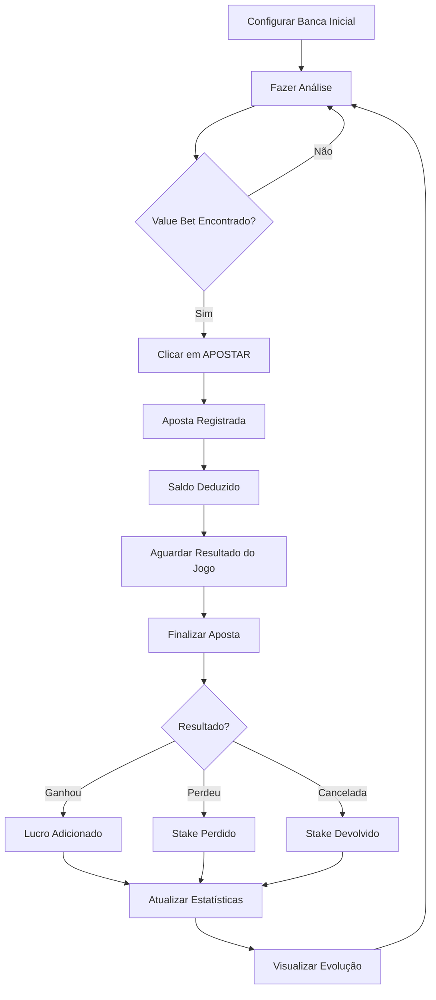

# 💰 Guia de Gerenciamento de Banca

## 📋 Visão Geral

O sistema de gerenciamento de banca permite que você:
- ✅ Configure e acompanhe sua banca real
- ✅ Registre apostas automaticamente com um clique
- ✅ Acompanhe apostas pendentes
- ✅ Finalize apostas quando os jogos terminarem
- ✅ Visualize histórico completo
- ✅ Acompanhe evolução e ROI da banca

## 🚀 Como Começar

### 1. Configurar Banca Inicial

1. Abra o aplicativo Streamlit
2. Vá para a aba **"💰 Gerenciamento de Banca"**
3. Insira o valor inicial da sua banca (ex: R$ 1.000,00)
4. Clique em **"✅ Configurar Banca"**

> ⚠️ **Importante:** Este valor será registrado como seu saldo inicial. Você pode adicionar/remover fundos depois nas configurações avançadas.

### 2. Fazer Análise de Apostas

1. Vá para a aba **"🎯 Análise de Apostas"**
2. Selecione uma partida da Premier League
3. Insira as odds da casa de apostas
4. Clique em **"🔍 ANALISAR APOSTAS"**

O sistema irá:
- Calcular probabilidades usando 3 modelos (Dixon-Coles, Offensive-Defensive, Heurísticas)
- Identificar Value Bets (apostas com valor positivo)
- Calcular recomendação de stake usando Kelly Criterion
- Usar sua banca real para os cálculos

### 3. Registrar Uma Aposta

Quando o sistema identificar Value Bets:

1. Veja as recomendações com todas as métricas (EV%, Kelly%, etc.)
2. **Opcional:** Ajuste o valor da aposta se desejar
3. **Opcional:** Adicione observações (ex: "Time em boa forma")
4. Clique em **"💰 APOSTAR R$ XX.XX"**

O sistema automaticamente:
- ✅ Registra a aposta no banco de dados
- ✅ Deduz o valor da sua banca
- ✅ Adiciona à lista de apostas pendentes

### 4. Acompanhar Apostas Pendentes

1. Vá para **"💰 Gerenciamento de Banca"** > **"⏳ Apostas Pendentes"**
2. Veja todas as apostas em aberto
3. Cada aposta mostra:
   - Informações da partida e mercado
   - Odds e valor apostado
   - Análise (probabilidade, EV%, Kelly%)
   - Data de criação

### 5. Finalizar Uma Aposta

Após o jogo terminar:

1. Vá em **"⏳ Apostas Pendentes"**
2. Expanda a aposta desejada
3. Selecione o resultado:
   - **✅ Ganhou** - Você acertou a aposta
   - **❌ Perdeu** - A aposta perdeu
   - **⚪ Cancelada** - Jogo cancelado/odds devolvidas
4. **Opcional:** Adicione observações sobre o resultado
5. Clique em **"Confirmar Resultado"**

O sistema automaticamente:
- ✅ Atualiza o saldo da banca
- ✅ Registra lucro/prejuízo
- ✅ Move para o histórico
- ✅ Atualiza estatísticas

## 📊 Acompanhamento e Análise

### Histórico de Apostas

Em **"📜 Histórico"** você pode:
- Ver todas as apostas (pendentes e finalizadas)
- Filtrar quantidade de apostas exibidas
- Identificar rapidamente ganhos (verde), perdas (vermelho) e canceladas (cinza)
- Exportar dados (via Streamlit)

### Estatísticas

Em **"📊 Estatísticas"** você vê:
- Total de apostas realizadas
- Taxa de acerto (Win Rate)
- Lucro/Prejuízo total
- ROI (Return on Investment)
- Stake médio por aposta
- Apostas pendentes

### Evolução da Banca

Em **"📈 Evolução da Banca"** você visualiza:
- Gráfico de linha mostrando evolução do saldo
- Linha de referência do valor inicial
- Detalhes de cada transação (hover no gráfico)
- Tabela com todas as variações

## ⚙️ Configurações Avançadas

### Adicionar/Remover Fundos

Use quando você:
- Depositar mais dinheiro na banca
- Retirar lucros
- Fazer ajustes manuais

**Passos:**
1. Vá em **"⚙️ Configurações Avançadas"**
2. Digite o valor (positivo para adicionar, negativo para remover)
3. Informe o motivo (ex: "Depósito adicional", "Retirada de lucros")
4. Clique em **"Aplicar Ajuste"**

### Resetar Banca

⚠️ **ATENÇÃO: Isso deleta TUDO (apostas, histórico, estatísticas)**

Use apenas se quiser recomeçar do zero.

**Passos:**
1. Vá em **"⚙️ Configurações Avançadas"**
2. Digite o novo valor inicial
3. Marque a caixa de confirmação
4. Clique em **"🗑️ RESETAR TUDO"**

## 💡 Dicas e Boas Práticas

### Gerenciamento de Banca

1. **Comece conservador:** Use Kelly Fraction de 0.25 (25% do Kelly completo)
2. **Não aposte tudo:** Nunca coloque mais de 5% da banca em uma única aposta
3. **Registre tudo:** Sempre registre suas apostas pelo sistema para tracking preciso
4. **Atualize regularmente:** Finalize apostas assim que souber o resultado

### Análise de Value Bets

1. **Confie no EV:** Aposte apenas quando EV% > 0
2. **Veja múltiplas casas:** Compare odds de diferentes casas para encontrar melhor value
3. **Use Kelly:** O Kelly Criterion otimiza crescimento da banca no longo prazo
4. **Seja paciente:** Nem todas as partidas terão value bets

### Acompanhamento

1. **Monitore ROI:** Um bom ROI de longo prazo é 5-10%
2. **Taxa de acerto:** Com value betting, 45-55% de acerto pode ser lucrativo
3. **Analise erros:** Veja apostas perdidas e aprenda com elas
4. **Adapte estratégia:** Ajuste Kelly Fraction conforme resultados

## 📈 Métricas Importantes

### Expected Value (EV)
- **O que é:** Retorno médio esperado por real apostado
- **Bom:** EV% > 5%
- **Excelente:** EV% > 10%

### Kelly Criterion
- **O que é:** Fração ótima da banca a apostar
- **Kelly Full (100%):** Agressivo, alta variância
- **Kelly 25%:** Conservador, recomendado para iniciantes
- **Kelly 50%:** Moderado, bom balanço

### ROI (Return on Investment)
- **O que é:** Lucro/prejuízo em relação ao total apostado
- **Fórmula:** (Lucro Total / Total Apostado) × 100
- **Bom:** ROI > 5% no longo prazo
- **Excelente:** ROI > 10%

### Win Rate (Taxa de Acerto)
- **O que é:** Porcentagem de apostas ganhas
- **Important:** Win rate sozinho não significa lucro!
- **Com value betting:** 45% de acerto pode ser lucrativo se EV for bom

## 🗄️ Estrutura de Dados

### Banco de Dados

O sistema usa SQLite (`data/bankroll.db`) com 3 tabelas:

1. **bankroll:** Saldo atual e inicial
2. **bets:** Todas as apostas registradas
3. **bankroll_history:** Histórico de todas as transações

### Backup

Recomendado fazer backup regular do arquivo `data/bankroll.db`:
```bash
# Windows
copy data\bankroll.db data\bankroll_backup_YYYYMMDD.db

# Linux/Mac
cp data/bankroll.db data/bankroll_backup_YYYYMMDD.db
```

## 🆘 Solução de Problemas

### Erro: "Banca não configurada"
**Solução:** Vá em "Gerenciamento de Banca" e configure o valor inicial

### Erro: "Saldo insuficiente"
**Solução:** Sua banca atual não tem fundos suficientes para a aposta
- Adicione fundos nas configurações avançadas, ou
- Reduza o valor da aposta

### Apostas não aparecem
**Solução:** 
- Verifique se está na aba "Apostas Pendentes"
- Recarregue a página (Ctrl+R)
- Verifique se o arquivo `data/bankroll.db` existe

### Gráfico de evolução vazio
**Solução:** Você precisa registrar pelo menos uma aposta primeiro

## 📞 Suporte

Para dúvidas ou problemas:
1. Consulte a documentação em `docs/`
2. Veja exemplos em `example_usage.py`
3. Execute o teste: `python bankroll_manager.py`

## 🎯 Workflow Completo



---

**Versão:** 1.0  
**Data:** Outubro 2025  
**Autor:** Sistema de Análise Esportiva v3

